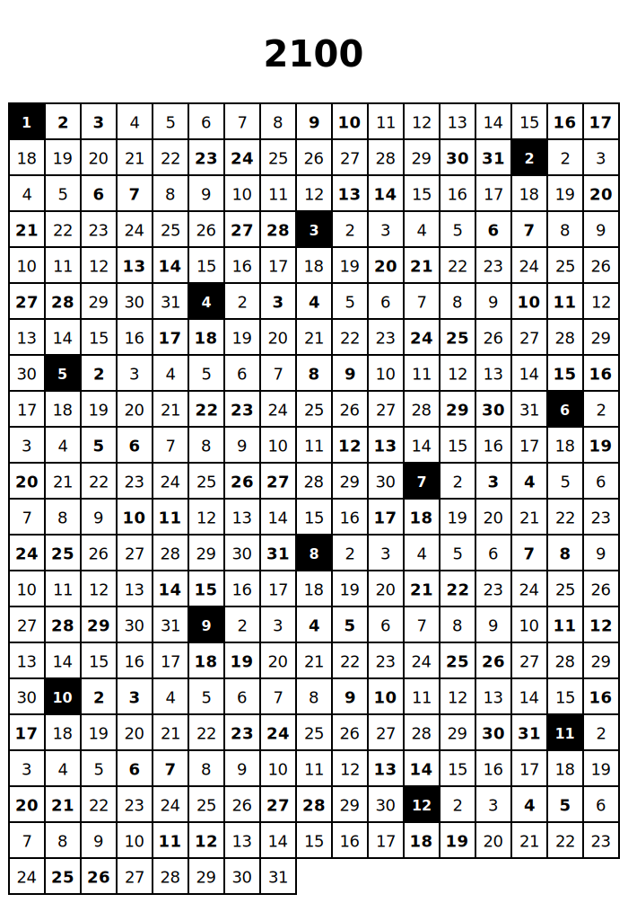

# year-on-a-page

The entire year on a single page.

Includes single-page calendars from year 2000 to 2100, in both [SVG](renders/svg) and [PDF](renders/pdf) formats.

Print them out and follow along to better appreciate the flow of time.

  

